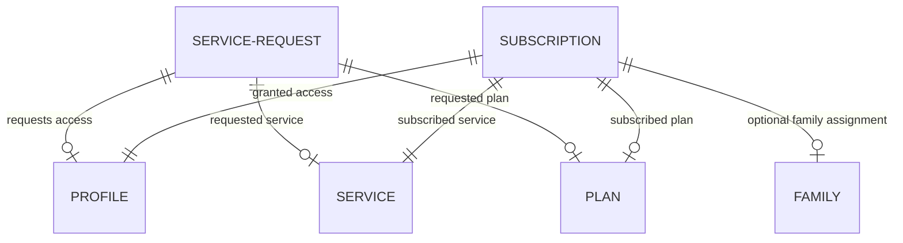

# Clean Separation: Service Requests vs. Active Subscriptions

We have successfully migrated the EasyCart SME architecture to establish a clean separation of concerns between historical/approval **Service Requests** and active **Subscription/Access Lifecycles**.

---

## 📐 Architecture and DB Schema Separation

*   **ServiceRequest**: Remains purely an historical approval record. It tracks the request creation, custom message, admin review notes, reviewed by/at timestamps, and the original requested parameters.
*   **Subscription**: Created automatically upon admin approval of a request. It manages the active access lifecycle: start date, expiration date, enum status (`ACTIVE`, `EXPIRED`), and an optional family association.

---

## 🛠️ Key File and API Implementations

### 1. Backend Layer

*   **[`Subscription.java`](file:///c:/Users/hp/Documents/My%20service/Easycart%202.1/backend/src/main/java/com/easycart/sme/entity/Subscription.java)**:
    *   Entity housing the active lifecycle (`id`, `user`, `service`, `plan`, `startDate`, `expiresAt`, `status` [ACTIVE/EXPIRED], `family` [optional assignment]).
*   **[`SubscriptionRepository.java`](file:///c:/Users/hp/Documents/My%20service/Easycart%202.1/backend/src/main/java/com/easycart/sme/repository/SubscriptionRepository.java)**:
    *   DB operations and queries including user-specific subscription retrieval.
*   **[`SubscriptionResponse.java`](file:///c:/Users/hp/Documents/My%20service/Easycart%202.1/backend/src/main/java/com/easycart/sme/dto/SubscriptionResponse.java)**:
    *   Exposes active subscriptions cleanly matching frontend expectation parameters.
*   **[`ServiceRequestService.java`](file:///c:/Users/hp/Documents/My%20service/Easycart%202.1/backend/src/main/java/com/easycart/sme/service/ServiceRequestService.java)**:
    *   Upon request approval, automatically determines whether the user belongs to a family (as organizer or active member) and creates the `Subscription` with calculated/custom dates and links.
*   **[`AdminController.java`](file:///c:/Users/hp/Documents/My%20service/Easycart%202.1/backend/src/main/java/com/easycart/sme/controller/AdminController.java)**:
    *   Exposes `GET /api/admin/subscriptions` to retrieve active individual subscriptions.
    *   Dynamically checks active expiring subscriptions inside the `Subscription` table for the notice feed.

### 2. Frontend Layer

*   **[`api.js`](file:///c:/Users/hp/Documents/My%20service/Easycart%202.1/frontend/js/api.js)**:
    *   Integrated `Admin.getSubscriptions()` mapper.
*   **[`admin.js`](file:///c:/Users/hp/Documents/My%20service/Easycart%202.1/frontend/js/admin.js)**:
    *   Loads and maps subscriptions during system boot and request reviews.
    *   Computes upcoming individual alerts from active subscriptions.
    *   Displays individual active subscriptions within both the "Subscriptions Tracker" dashboard columns and the "User Intelligence" detail lists.

---

> [!TIP]
> The database migrations are fully handled by Hibernate `ddl-auto=update` on startup. The application is completely ready to run!
