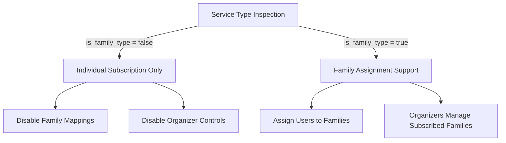

# Families to Service Mapping & Validation Architecture

We have successfully refined the EasyCart SME platform structure to explicitly map families to their corresponding services. This ensures robust data integrity, prevents logical conflicts, and establishes clear validation rules between individual and family subscription types.

---

## 🛢️ PostgreSQL ALTER TABLE Schema Migration

If you are applying manual database migrations, use the following DDL statements to alter the `families` table structure:

```sql
-- 1. Add the nullable service_id column first
ALTER TABLE families ADD COLUMN service_id UUID;

-- 2. Populate service_id from plan_id for any existing records to prevent data loss
UPDATE families f 
SET service_id = (SELECT service_id FROM plans p WHERE p.id = f.plan_id)
WHERE f.plan_id IS NOT NULL;

-- 3. Set service_id to not-null constraint after populating
ALTER TABLE families ALTER COLUMN service_id SET NOT NULL;

-- 4. Create foreign key constraint referencing services table
ALTER TABLE families 
ADD CONSTRAINT fk_families_service 
FOREIGN KEY (service_id) 
REFERENCES services(id) 
ON DELETE RESTRICT;
```

> [!NOTE]
> Since Spring Boot is configured with `spring.jpa.hibernate.ddl-auto=update` in development, Hibernate will automatically initialize the `service_id` column at startup.

---

## 📐 Architecture & Validation Matrix



### 1. Service-Level Restrictions
*   **Non-Family Services (`isFamilyType = false`)**:
    *   No family containers are allowed.
    *   All customer approvals result purely in individual `Subscription` records.
    *   Organizer assignment and user groupings do not apply.
*   **Family Services (`isFamilyType = true`)**:
    *   Families can be created to group members.
    *   Organizers manage these family containers.

### 2. Backend Validation Controls
*   **Family Creation Validation**:
    *   Validates that the selected `serviceId` is marked as `isFamilyType = true`.
    *   If a specific `planId` is supplied, validates that the plan belongs directly to the chosen service.
*   **Membership Assignment Validation**:
    *   When adding a customer to a family, the backend inspects `ServiceRequest` approvals to guarantee the user has been approved for the family’s exact service.
    *   Prevents cross-service family assignments.

### 3. Dashboard Isolation
*   **Organizer Isolation**:
    *   Organizers are restricted so they only view families matching the services to which they hold an active subscription.

---

## 📁 Key File Changes

*   **[`Family.java`](file:///c:/Users/hp/Documents/My%20service/Easycart%202.1/backend/src/main/java/com/easycart/sme/entity/Family.java)**:
    *   Added `@ManyToOne` mapping for `service`.
*   **[`CreateFamilyDto.java`](file:///c:/Users/hp/Documents/My%20service/Easycart%202.1/backend/src/main/java/com/easycart/sme/dto/CreateFamilyDto.java)**:
    *   Exposed and validated `serviceId` field.
*   **[`FamilyResponse.java`](file:///c:/Users/hp/Documents/My%20service/Easycart%202.1/backend/src/main/java/com/easycart/sme/dto/FamilyResponse.java)**:
    *   Mapped `serviceId` and `serviceName` directly from the `Family` entity's new service attribute.
*   **[`AdminController.java`](file:///c:/Users/hp/Documents/My%20service/Easycart%202.1/backend/src/main/java/com/easycart/sme/controller/AdminController.java)**:
    *   Added validation for family service compatibility on creation.
    *   Added validation for approved requested services on user family addition.
*   **[`FamilyController.java`](file:///c:/Users/hp/Documents/My%20service/Easycart%202.1/backend/src/main/java/com/easycart/sme/controller/FamilyController.java)**:
    *   Filtered the organizer's visible families to match only their active service subscriptions.
*   **[`admin.js`](file:///c:/Users/hp/Documents/My%20service/Easycart%202.1/frontend/js/admin.js)**:
    *   Forwarded `serviceId` in the family creation request payload and validated selection.
