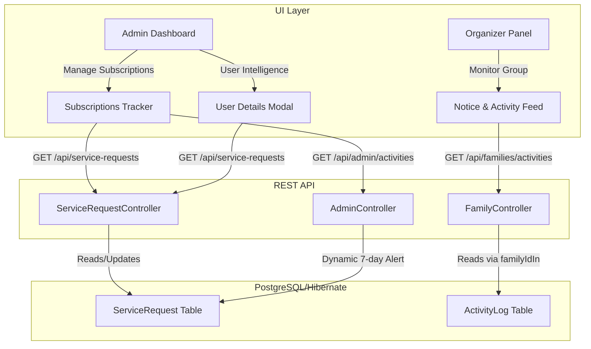

# Individual Subscription Cycles & Organizer Activity Logs

We have completed the transition of EasyCart SME to treat families as containers while managing actual **Subscription Cycles individually**. In addition, we implemented dedicated **Organizer Activity Logs** and restricted service types.

---

## 🛠️ Architecture Overview

---

## 📁 Key File Changes

### 1. Backend Controllers

*   **[`AdminController.java`](file:///c:/Users/hp/Documents/My%20service/Easycart%202.1/backend/src/main/java/com/easycart/sme/controller/AdminController.java)**:
    *   Injected `ServiceRequestRepository`.
    *   Updated `getActivityLogs()` to dynamically inspect approved individual subscriptions expiring within 7 days, injecting them as virtual `SYSTEM` alerts to avoid bloated databases or cron jobs.
    *   Logged a custom audit entry (`ADD_MEMBER`) tagged with `familyId` on family member additions.
*   **[`FamilyController.java`](file:///c:/Users/hp/Documents/My%20service/Easycart%202.1/backend/src/main/java/com/easycart/sme/controller/FamilyController.java)**:
    *   Appended `familyId` directly to `REMOVE_MEMBER` logs for query mapping.
    *   Exposed `GET /api/families/activities` to allow organizers to view activities occurring inside their families.
*   **[`ServiceController.java`](file:///c:/Users/hp/Documents/My%20service/Easycart%202.1/backend/src/main/java/com/easycart/sme/controller/ServiceController.java)**:
    *   Added `isFamilyType` Boolean check in both `listActive()` and `getOne()` response mappings.

### 2. Frontend Interfaces

*   **[`api.js`](file:///c:/Users/hp/Documents/My%20service/Easycart%202.1/frontend/js/api.js)**:
    *   Added `Organizer.getActivities` mapping.
    *   Added `ServiceRequests.getAll` mapping.
*   **[`admin.html`](file:///c:/Users/hp/Documents/My%20service/Easycart%202.1/frontend/admin.html)**:
    *   Split the subscription tracking grid into side-by-side columns: **Family Subscriptions** and **Individual Subscriptions**.
    *   Integrated custom start and expiry date selectors in the service request review modal.
    *   Added an **Active Subscriptions (Start & Expiry)** container in the user details popup.
*   **[`admin.js`](file:///c:/Users/hp/Documents/My%20service/Easycart%202.1/frontend/js/admin.js)**:
    *   Updated `loadRequests()` to fetch all requests and filtered them appropriately on display.
    *   Updated `renderOverview()` to compute both family and individual expirations in the notice badges.
    *   Enriched approved individual requests as independent active subscription items and rendered them side-by-side with families.
    *   Mapped custom dates into the review payload and cleared inputs on close.
    *   Restricted family service selection to services where `isFamilyType === true`.
*   **[`organizer.html`](file:///c:/Users/hp/Documents/My%20service/Easycart%202.1/frontend/organizer.html)**:
    *   Appended a premium **Notice & Activity Feed** card on the overview tab.
*   **[`organizer.js`](file:///c:/Users/hp/Documents/My%20service/Easycart%202.1/frontend/js/organizer.js)**:
    *   Implemented `loadOrganizerActivities()` and time ago formatter.

---

> [!NOTE]
> All Java changes compile successfully under Spring Boot and Maven with zero syntax issues. The local dev environment is fully ready for verification.
